# YOLO-like model from Scratch
This project is about making YOLO-like model from scratch in order to understand it's architecture on lower level and because it's a cool project sar.

[](https://www.youtube.com/watch?v=dBpNzq9-vfI)

## What's YOLO
YOLO stands for You Only Look Once is object detection model with unique approach of predicting bounding boxes and class probabilities directly from full images in one evaluation which is much faster then previous two-stage detectors like RCNN or Fast-RCNN.


Read it sar: <br>
https://arxiv.org/abs/1506.02640
<br>
https://docs.ultralytics.com/#faq
<br>
https://arxiv.org/abs/2304.00501

## First approach: 3 detections heads
In the previous experiment there was an issue with detecting person that are close or far away, it seemed like model was good at being average and had problems with edge-cases. This weakness has been improved by adding 3 detection heads:
 - 52x52 head for small object
 - 26x26 head for medium objects
 - 13x13 head for large images

### Model flow
| Stage | What does it do? | Detection? | Classification? |
|---|---|---|---|
| Backbone | Visual features | NO | NO |
| FPN | Combine scales | NO | NO |
| Head conv blocks | Refine for prediction | NOT YET | NOT YET |
| **Final 1×1 Conv** | **Output channels** | **YES** (ch 0-4) | **YES** (ch 5+) |

#### Backbone
Backbone (Darknet-lite, 5 residual stages) is task-agnostic. It does not recognise concepts such as 'here is a person' or 'here is a box'. It learns to recognise generic visual patterns at increasingly higher levels of abstraction:

- First layers: edges, gradients, textures
- Central: parts of objects (body parts, faces, clothes)
- Deep: whole objects + context (recognises ‘this is a person’ in a semantic sense)

#### FPN
Nor does it predict, semantic transfer.

This solves a specific problem: feat_52 has excellent spatial resolution (52x52 = many cells = good for small objects), BUT shallow features — it can detect textures, but doesn't recognise what a 'person' is. In contrast, feat_13 has deep semantic features (“this is a person”), but poor resolution (13x13 = few cells = coarse grain).

Top-down FPN: transfers semantic understanding from deep layers to shallow ones. feat_13 → 2x upsampling → concatenation with feat_26 → now feat_26 has its own spatial detail + “knows what a person is” from the depth. Repeats for feat_52.

Result: detection of small objects (head 52) benefits from the deep semantic understanding transferred from deep features. Without FPN, small objects would be difficult — cells would only see textures without context.

Still — FPN does not predict, it merely blends features.

#### Detection Heads
This is where detection and classification take place.

Each head consists of a two-stage mechanism:
 1. Conv blocks (refinement) — several conv_blocks with a mix of 1x1 and 3x3 kernels. They transform features in the direction required for prediction. It's a bit like “an MLP dressed up as a convolutional network” — the model learns: “OK, these FPN-enriched features are general; tweak them so that they represent boxes and classes”.

 2. Final Conv2D(out_channels, kernel=1) — this single 1x1 convolution produces all the predictions. For v3 single-class:
      ```python
      out_channels = num_boxes * 5 + num_classes = 1 * 5 + 1 = 6
      ```
Key point: 1x1 conv = 'fully-connected per-cell'. Each cell makes a decision independently based on its own features (channels). 1x1 does not mix information from neighbouring cells — it operates point-by-point, cross-channel. This is why we can say 'cell (gy, gx) is responsible' — because the decision is literally per-cell.

```
channels [0:4]  →  xc, yc, w, h      →  DETECTION (where the box is)
channel  [4]    →  confidence        →  OBJECTNESS (whether it exists at all)
channels [5:]   →  class probabilities       →  CLASSIFICATION (what it is)
```

### Why three detection heads — the multi-scale rationale

A single 13x13 grid has fundamental limitations with size variation:

```
416 / 13 = 32 pixels per cell
```

This means each cell "owns" a 32x32 px region. Consider what happens with different object sizes:
- **Small object (20x20 px in input)**: fits entirely inside one cell. The cell's receptive field is way larger than the object → most of the activations are background → weak signal.
- **Medium object (100x100 px)**: spans ~3x3 cells. Workable — one center cell can take responsibility.
- **Large object (300x300 px, foreground person)**: spans ~10x10 cells. Which cell is "responsible"? The one with the object's center. But that cell has only seen a small patch of the object — it doesn't have visibility into the whole thing.

The main thing is the cells share the same conv weights, so we want it to be good at basically everything (small, medium or big objects), so in the result we get model which is mediocre at everything, terrible at the extremes.

### How three heads fix the problems

Each scale has its own receptive field per cell:

| Scale | Stride | Cell size | Specializes in |
|-------|--------|-----------|----------------|
| 13x13 | 32 | 32x32 px | Large objects (>40% of image) |
| 26x26 | 16 | 16x16 px | Medium objects (15-40%) |
| 52x52 | 8 | 8x8 px | Small objects (<15%) |

The encoder routes each ground-truth object to **ONE scale** based on its `max(w, h)`:
- `max(w, h) < 0.15` → 52x52 head
- `0.15 ≤ max(w, h) < 0.40` → 26x26 head
- `max(w, h) ≥ 0.40` → 13x13 head

This means each head **only trains on objects in its size range**. No more weight-sharing conflicts:
- The 13x13 head's conv weights specialize in "what does a big object look like, and how to box it"
- The 52x52 head's conv weights specialize in "what does a small object look like"
- No compromise, no conflict

During inference, all 3 heads predict in parallel. Each typically lights up for objects in its target size range. The final list goes through unified NMS to dedupe (in case an object near the size threshold gets flagged on two adjacent scales).

### Why FPN (top-down feature fusion)

The heads aren't independent — they connect via Feature Pyramid Network top-down. The deepest features (13x13, after the full backbone) are upsampled and concatenated with shallower features before feeding the 26x26 head. Same trick from 26 to 52.

**Why this matters**: deep features have rich **semantic info** ("this looks like a person") but coarse spatial resolution. Shallow features have fine **spatial detail** but weaker semantics. The small-object head needs BOTH — it needs to know "is this a person" (semantics from deep) AND "where exactly are its edges" (spatial from shallow).

Without FPN, the 52x52 head would only have shallow features and would mostly learn texture-level patterns (not "person-shaped" patterns). FPN gives it semantic grounding while preserving spatial resolution.

### What is cell?
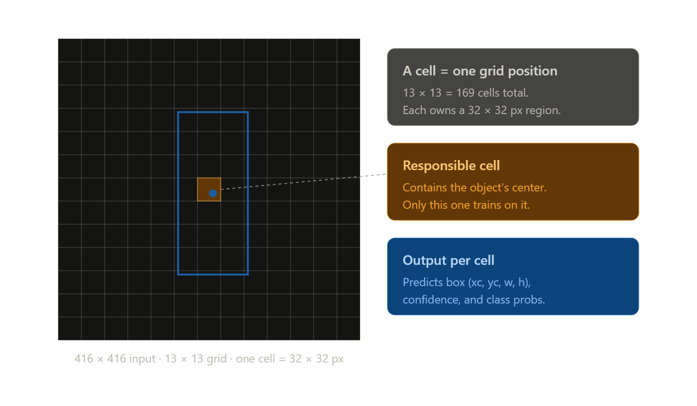

Each "cell" is **a single point in the model's input grid**. If the model outputs a tensor of size `(13, 13, ...)`, you have 169 cells (13x13). Each cell **"owns" a portion of the image** — with a 13x13 grid on a 416x416 input, this is exactly 32x32 pixels (416/13=32).

"Owns" specifically means: **if the centre of the object falls within the area of that cell (RF not included, only 32px area in case of 13x13 head), THEN it is responsible for its prediction.** And only that cell — other cells for that object have `obj_mask=0` and learn nothing about it. Only the responsible cell has `obj_mask=1` and it is this cell that receives the gradient from the coord loss, class loss, etc.

**An important distinction — "owns" ≠ "sees":** a cell *owns* its 32x32 px patch under its responsibility, but through the convolutional network it *sees* much more. This is called the **receptive field** — the area of the input that actually influences the value of that cell. A 13x13 cell, after passing through the entire backbone, has a receptive field of several hundred pixels — practically half the image. This is why deep cells perform well with large objects: they can see the entire object even though they *own* only a small fragment of it.

### What is receptive field?
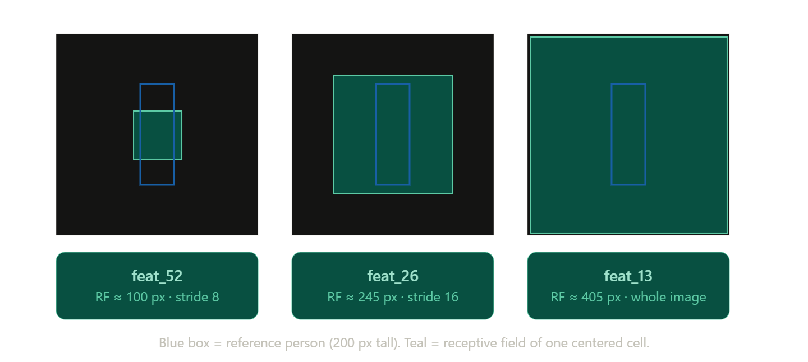

The receptive field is the portion of the input image that influences the value of a single cell in the activation map. Each convolutional layer aggregates information from a local window, so the deeper the layer, the larger the RF becomes. It is calculated recursively using two formulas:

```
RF_after  = RF_before + (kernel_size - 1) * jump_before
jump_after = jump_before * stride
```
Where jump is the distance in pixels of the input image between the centres of the RFs of two adjacent cells (i.e. 'at what speed' the RF moves across the image). We start with RF=1, jump=1 (one pixel affects only itself).

**Quick rules:**

- `Conv2D(kernel=3, stride=1)` → `RF += 2 * jump`, jump unchanged
- `Conv2D(kernel=3, stride=2)` → `RF += 2 * jump`, then `jump *= 2`
- `Conv2D(kernel=1, ...)` → no RF change (kernel - 1 = 0)
- Residual block (`1x1 → 3x3 stride 1`) counts effectively as one 3x3 conv (the 1x1 contributes nothing)

### Stage-by-stage calculation

| Layer | kernel | stride | jump after | RF after |
|---|---|---|---|---|
| (start) | — | — | 1 | 1 |
| Stem · conv 3x3, s=1 | 3 | 1 | 1 | **3** |
| Stage 1 · conv 3x3, s=2 | 3 | 2 | 2 | 5 |
| Stage 1 · 1 res block | 3 | 1 | 2 | **9** |
| Stage 2 · conv 3x3, s=2 | 3 | 2 | 4 | 13 |
| Stage 2 · 2 res blocks | 3 | 1 | 4 | 21 → **29** |
| Stage 3 · conv 3x3, s=2 | 3 | 2 | 8 | 37 |
| Stage 3 · 4 res blocks | 3 | 1 | 8 | 53 → 69 → 85 → **101** ← `feat_52` |
| Stage 4 · conv 3x3, s=2 | 3 | 2 | 16 | 117 |
| Stage 4 · 4 res blocks | 3 | 1 | 16 | 149 → 181 → 213 → **245** ← `feat_26` |
| Stage 5 · conv 3x3, s=2 | 3 | 2 | 32 | 277 |
| Stage 5 · 2 res blocks | 3 | 1 | 32 | 341 → **405** ← `feat_13` |

### Final results per head

| Head | Stride | Theoretical RF | Effective RF (~½ of theoretical) |
|---|---|---|---|
| `feat_52` | 8 | ~100 px | ~50 px |
| `feat_26` | 16 | ~245 px | ~125 px |
| `feat_13` | 32 | ~405 px (≈ entire 416 px image) | ~200 px |

### Theoretical vs effective RF

The numbers in the table are **theoretical** — the maximum area that *could* affect a cell's value. In practice the **effective receptive field** (Luo et al. 2017) is about half, because the central pixels dominate the weighting while the edges are exponentially attenuated.

Hierarchy stays the same regardless — feat_52 < feat_26 < feat_13.

### Why RF grows so fast in deeper stages

Every stride-2 conv **doubles the jump**, so each subsequent residual block contributes more pixels to RF than the last:

- Stage 3 res blocks: **+16 px** each (jump = 8)
- Stage 4 res blocks: **+32 px** each (jump = 16)
- Stage 5 res blocks: **+64 px** each (jump = 32)

RF grows roughly exponentially with depth, not linearly. That's why just 2 res blocks in Stage 5 take RF from 277 → 405, while 4 res blocks in Stage 3 took it from 37 → 101.

### How do we get to 52, 26, 13 from input 416x416?

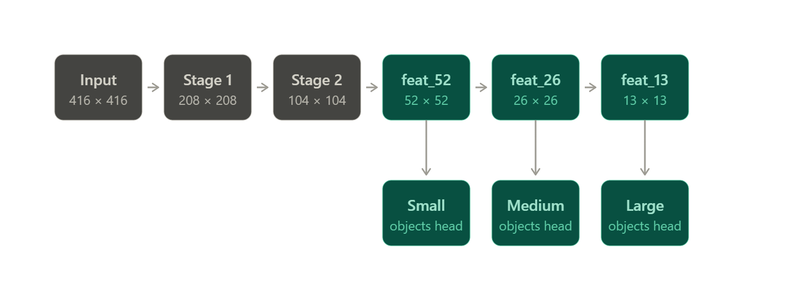

```python
x = conv_block(inputs, w(32))           # stem — no stride, stays 416
x = conv_block(x, w(64), strides=2)     # Stage 1 input: 416 → 208 ← halving
# residual blocks (stride=1) — don't change spatial dim
x = conv_block(x, w(128), strides=2)    # Stage 2 input: 208 → 104 ← halving
x = conv_block(x, w(256), strides=2)    # Stage 3 input: 104 → 52  ← halving
feat_52 = x                              # Head for smol objects (52x52)
x = conv_block(x, w(512), strides=2)    # Stage 4 input: 52 → 26   ← halving
feat_26 = x                              # Head for medium (26x26)
x = conv_block(x, w(1024), strides=2)   # Stage 5 input: 26 → 13   ← halving
feat_13 = x                              # Head for big boys (13x13)
```

Each stage starts with conv_block with strides=2 which divides dim in half.

```
416 → 208 → 104 → 52 → 26 → 13
       ↑     ↑    ↑     ↑    ↑
       /2    /2   /2    /2   /2
```

5 divided by 2 five times = `2^5 = 32` times smaller (416/32 = 13). That is why the stride of the deepest scale is 32.

**The deeper the stage, the:**
- **Fewer cells** (more downsampling). 13x13 = 169 cells is ~16x fewer than 52x52 = 2704
- **A larger receptive field per cell.** A cell in a 13x13 grid sees a wider section of the image because many layers of convolution have accumulated
- **Richer semantics.** Deep features "understand" what an object is (a person? a car?), whilst shallow ones only see textures

That is why routing based on object size makes sense:
- **Small object** → needs a dense grid (52x52) to fit into a single cell with meaningful ownership, but its receptive field does not need to be large because the object is small
- **Large object** → its centre will easily fit within a 13x13 grid (a 32x32 px "own" cell, the centre will fit there), and a deep cell has a receptive field that sees the entire large figure


### Model definition
```python
def conv_block(x, filters: int, kernel_size: int = 3, strides: int = 1):
    """Conv -> BN -> LeakyReLU."""
    x = layers.Conv2D(filters, kernel_size, strides=strides,
                      padding='same', use_bias=False,
                      kernel_initializer='he_normal')(x)
    x = layers.BatchNormalization()(x)
    x = layers.LeakyReLU(0.1)(x)
    return x


def residual_block(x, filters: int):
    """
    Darknet-style residual block: 1x1 reduction -> 3x3 expansion -> skip.
    The input and output have `filters` channels (skip requires compatibility).
    """
    shortcut = x
    x = conv_block(x, filters // 2, kernel_size=1)
    x = conv_block(x, filters, kernel_size=3)
    return layers.Add()([shortcut, x])

def build_detector(img_size: int = IMG_SIZE,
                   num_classes: int = NUM_CLASSES,
                   width_multiplier: float = 0.5,
                   num_residual: Tuple[int, int, int, int, int] = (1, 2, 4, 4, 2)) -> Model:
    """
    Multi-scale detector. Zwraca model z 3 wyjściami (lista tensorów).

    width_multiplier: scales filters
    num_residual: The number of residual blocks across the 5 stages of the backbone.
                  Darknet-53 has (1,2,8,8,4) — I used a byt less sar
    """
    def w(n):
        scaled = int(n * width_multiplier)
        return max(8, (scaled + 4) // 8 * 8)

    out_channels = NUM_BOXES * 5 + num_classes

    inputs = layers.Input(shape=(img_size, img_size, 3), name='image')

    # ============================================================
    #                  BACKBONE (Darknet-lite)
    # ============================================================
    # Stem
    x = conv_block(inputs, w(32))

    # Stage 1: 416 -> 208
    x = conv_block(x, w(64), strides=2)
    for _ in range(num_residual[0]):
        x = residual_block(x, w(64))

    # Stage 2: 208 -> 104
    x = conv_block(x, w(128), strides=2)
    for _ in range(num_residual[1]):
        x = residual_block(x, w(128))

    # Stage 3: 104 -> 52 - route to scale 52x52 (small objects)
    x = conv_block(x, w(256), strides=2)
    for _ in range(num_residual[2]):
        x = residual_block(x, w(256))
    feat_52 = x

    # Stage 4: 52 -> 26 - route to scale 26x26 (medium objects)
    x = conv_block(x, w(512), strides=2)
    for _ in range(num_residual[3]):
        x = residual_block(x, w(512))
    feat_26 = x

    # Stage 5: 26 -> 13 - route to scale 13x13 (big objects)
    x = conv_block(x, w(1024), strides=2)
    for _ in range(num_residual[4]):
        x = residual_block(x, w(1024))
    feat_13 = x

    # ============================================================
    #              DETECTION HEADS with FPN (top-down)
    # ============================================================
    # --- Scale 13x13 (large objs) ---
    x = conv_block(feat_13, w(512), kernel_size=1)
    x = conv_block(x, w(1024))
    x = conv_block(x, w(512), kernel_size=1)
    branch_13 = x # 13x13 scale
    head = conv_block(x, w(1024))
    output_13 = layers.Conv2D(out_channels, 1, name='output_13')(head)

    # --- Upsample 13 -> 26, connect with feat_26 ---
    x = conv_block(branch_13, w(256), kernel_size=1)
    x = layers.UpSampling2D(2)(x)
    x = layers.Concatenate()([x, feat_26])

    # --- Scale 26x26 (medium objects) ---
    x = conv_block(x, w(256), kernel_size=1)
    x = conv_block(x, w(512))
    x = conv_block(x, w(256), kernel_size=1)
    branch_26 = x # 26x26 scale
    head = conv_block(x, w(512))
    output_26 = layers.Conv2D(out_channels, 1, name='output_26')(head)

    # --- Upsample 26 -> 52, connect z feat_52 ---
    x = conv_block(branch_26, w(128), kernel_size=1)
    x = layers.UpSampling2D(2)(x)
    x = layers.Concatenate()([x, feat_52])

    # --- Scale 52x52 (small objects) ---
    x = conv_block(x, w(128), kernel_size=1)
    x = conv_block(x, w(256))
    x = conv_block(x, w(128), kernel_size=1)
    head = conv_block(x, w(256))
    output_52 = layers.Conv2D(out_channels, 1, name='output_52')(head) # scale 52x52

    # [13, 26, 52] — large, medium, small
    return Model(inputs, [output_13, output_26, output_52],
                 name=f'yolo_multiscale_{width_multiplier}')
```


### Loss function
```python
def yolo_loss(y_true: tf.Tensor, y_pred: tf.Tensor,
              num_classes: int = NUM_CLASSES,
              lambda_coord: float = 5.0,
              lambda_noobj: float = 0.3):
    """
    Single-scale YOLO loss.

    y_true: zakodowany target jednej skali (xy/wh w [0,1], conf 0/1)
    y_pred: raw logits jednej skali
    """
    obj_mask = y_true[..., 4:5]              # (B, S, S, 1)
    noobj_mask = 1.0 - obj_mask

    # B=1 — bez pętli po boxach
    true_xy = y_true[..., 0:2]
    true_wh = y_true[..., 2:4]
    true_conf = y_true[..., 4:5]

    pred_xy_raw = y_pred[..., 0:2]
    pred_wh_raw = y_pred[..., 2:4]
    pred_conf_raw = y_pred[..., 4:5]

    # Sigmoid na współrzędnych → [0, 1]
    pred_xy = tf.sigmoid(pred_xy_raw)
    pred_wh = tf.sigmoid(pred_wh_raw)

    # --- Coord loss (tylko obj cells) ---
    coord_loss = tf.reduce_sum(
        obj_mask * tf.square(true_xy - pred_xy)
    )
    coord_loss += tf.reduce_sum(
        obj_mask * tf.square(
            tf.sqrt(true_wh + 1e-6) - tf.sqrt(pred_wh + 1e-6)
        )
    )

    # --- Confidence BCE ---
    conf_bce = tf.nn.sigmoid_cross_entropy_with_logits(
        labels=true_conf, logits=pred_conf_raw
    )
    conf_loss = tf.reduce_sum(obj_mask * conf_bce)
    conf_loss += lambda_noobj * tf.reduce_sum(noobj_mask * conf_bce)

    # --- Class BCE (tylko obj cells) ---
    true_class  = y_true[..., 5:]
    pred_class_raw = y_pred[..., 5:]
    class_bce = tf.nn.sigmoid_cross_entropy_with_logits(
        labels=true_class, logits=pred_class_raw
    )
    class_loss = tf.reduce_sum(obj_mask * class_bce)

    batch_size = tf.cast(tf.shape(y_true)[0], tf.float32)

    return (lambda_coord * coord_loss + conf_loss + class_loss) / batch_size
```

### Sources:
- https://arxiv.org/abs/1612.03144
- https://arxiv.org/abs/1804.02767
- https://www.ultralytics.com/glossary/feature-pyramid-network-fpn


## Second approach: first model + anchors
This version was based on the first approach but extended by anchors. Anchors work as a "reference points" and thanks to that model can start from anchor boxes than learn them from scratch. Anchors are calculated for the dataset you're using, so using the same anchors in many projects will not work.

### Anchor boxes — what they are and why we need them
In simple words: anchors are shape priors that transform the task of 'learning every box shape from scratch' into 'selecting the closest template from K predefined ones and making a small adjustment' - kinda like bias.

### The core problems anchors solve

In a no-anchor detector, each grid cell directly predicts absolute `(w, h) ∈ [0, 1]`. This approach creates four training problems:

**1. Wide dynamic range with no prior structure**

Box sizes span 2-3 orders of magnitude — distant figures at `w ≈ 0.02`, close-ups at `w ≈ 0.9`. A single regressor has to cover this whole range with no bias about what's typical, wasting capacity discovering shape statistics that could simply be stated explicitly.

**2. Multimodal target distributions**

Real GT boxes cluster by shape — tall narrow (standing people), small square (distant figures), wide rectangular (seated/groups). A single regressor trained on this mix learns to predict near the MEAN of the distribution, which is wrong for every cluster individually. The classic bias-variance failure: one head can't be optimal for multiple shape modes simultaneously.

**3. Multiple boxes per cell without anchors → predictor collapse**

YOLOv1 used `B=2` boxes per cell to handle multiple objects sharing a center. Problem: both predictors are structurally identical and share the same weights — they collapse to nearly identical outputs. Without an inductive bias forcing each slot to specialize, the extra capacity is wasted.

**4. Cold-start instability**

A randomly initialized model produces random box shapes early in training. Most predictions have near-zero IoU with GT → weak gradient signal → slow bootstrap. The first epochs are essentially wasted noise before the model figures out "boxes are usually positive numbers in some reasonable range".

### How anchors fix this

Anchors are **K predefined box shapes** picked from training data (typically K-means with IoU distance). Instead of predicting absolute dimensions, each cell predicts a **small correction** relative to one of the K templates.

### Bayesian intuition

The term **prior** comes from Bayesian statistics: *before seeing the image, what shapes do we expect boxes to take?* Anchors encode that expectation as **architectural inductive bias**. The model then refines the prior based on visual evidence in the image.

Without anchors, the model has to learn the prior implicitly from data — slower and less explicit. With anchors, the prior is given to the model as a starting point and only the residual needs learning.

### What anchors cost

Anchors aren't free:
- Hyperparameter choice — K and concrete shapes (K-means handles this)
- More output channels per cell — `B=1` gives `5+C` channels, `A=3` anchors give `3·(5+C)`
- Encoder needs anchor-matching logic (which anchor does each GT box map to?)
- Decoder needs anchor-aware decoding
- Risk of unbounded `exp(tw)` without bounded parameterization (we hit this!)

For COCO-scale data (100k+ images, 80 classes) the complexity pays off. For smaller datasets the gain is marginal and overhead can outweigh the benefit.

### Why K-means? Why IoU distance instead of Euclidean?

**Why K-means:** anchors should match the actual shape distribution of objects in *our* dataset. Anchors derived from COCO (80 mixed classes) would be wrong for person-only detection (mostly tall vertical boxes). K-means clusters our GT boxes into K representative shapes — those centroids become our anchors.

**Why IoU distance, not Euclidean:** standard K-means uses Euclidean distance. For boxes that's biased toward large boxes — the difference between `(0.4, 0.6)` and `(0.5, 0.7)` is the same Euclidean distance as between `(0.04, 0.06)` and `(0.14, 0.16)`, but in terms of shape matching the small pair is far more different (one is 6x bigger).

IoU distance is **scale-invariant** — compares shapes as ratios, not absolute differences:
```
distance = 1 - IoU(box, centroid)
```

```python
# ============================================================
#       IoU "distance" for K-means
# ============================================================
# Standard K-means uses Euclidean distance, which favours
# large boxes (greater numerical difference). For anchors, we want to measure
# *shape similarity*, regardless of scale → IoU.
#
# We treat boxes as centred at the origin (0,0) — we compare only (w,h).
# IoU = intersection_area / union_area
# distance = 1 - IoU
# ============================================================
def iou_wh(boxes_a, boxes_b):
    """The IoU between two sets (w, h), assuming centring at the origin"""
    inter_w = np.minimum(boxes_a[:, None, 0], boxes_b[None, :, 0])
    inter_h = np.minimum(boxes_a[:, None, 1], boxes_b[None, :, 1])
    inter = inter_w * inter_h
    area_a = (boxes_a[:, 0] * boxes_a[:, 1])[:, None]
    area_b = (boxes_b[:, 0] * boxes_b[:, 1])[None, :]
    union = area_a + area_b - inter
    return inter / (union + 1e-9)

def kmeans_iou(boxes, k, max_iter=300, seed=42, verbose=True):
    """K-means with IoU as the similarity metric"""
    rng = np.random.default_rng(seed)
    n = len(boxes)

    # Init: K random boxes as initial centroids
    initial_idx = rng.choice(n, k, replace=False)
    centroids = boxes[initial_idx].copy()

    prev_assignments = None
    for iteration in range(max_iter):
        # IoU of each box vs each centroid → distance = 1 - IoU
        ious = iou_wh(boxes, centroids)
        distances = 1.0 - ious

        # Assign each box to the nearest centroid
        assignments = np.argmin(distances, axis=1)

        # Update the centroids as the mean (w, h) of the assigned boxes
        new_centroids = np.array([
            boxes[assignments == j].mean(axis=0)
            if (assignments == j).any() else centroids[j]
            for j in range(k)
        ])

        # convergence: how the assignments have not changed since the previous iteration
        if prev_assignments is not None and np.array_equal(assignments, prev_assignments):
            if verbose:
                print(f'Convergence in iter {iteration}')
            break
        prev_assignments = assignments
        centroids = new_centroids
    else:
        if verbose:
            print(f'Max iter ({max_iter}) reached, no convergence')

    return centroids, assignments
```

### Reading the Mean IoU number

After K-means converges, for every GT box in the dataset we find the **best matching anchor** (highest IoU). **Mean IoU** = average across all boxes.

**Intuition:** on average, how well do our predefined anchors fit a typical GT box *before* the model learns anything?

| Mean IoU | Interpretation |
|----------|----------------|
| **0.65 – 0.75** | Good — strong starting priors |
| **0.55 – 0.65** | OK — workable, more regression work for the model |
| **< 0.50** | Bad — anchors don't match data well |

**Our Mean IoU = 0.6646 on 78,470 boxes** — just above the "good" threshold. This means:
- Before any training, just picking "the nearest anchor" already gives 66% overlap with any GT box
- The model only needs to learn small refinements from there
- For comparison: the YOLOv2 paper reported 0.6116 on COCO with K=5 anchors. We get 0.66 with K=9 on person-only — slightly better, which makes sense (person-only is less shape-varied than full COCO)
- This number is our "**lower bound on box quality before training**" — final predicted boxes after training typically reach 0.85-0.95 IoU

```python
# ============================================================
#         Sort + rating quality sar
# ============================================================
# We sort the centroids by area (w×h) — from smallest to largest.
# The smallest 3 → 52×52 grid (small objects)
# The middle 3 → 26×26 (medium)
# The largest 3 → 13×13 (large)
areas = centroids[:, 0] * centroids[:, 1]
sort_idx = np.argsort(areas)
centroids_sorted = centroids[sort_idx]

# Mean IoU = the ‘quality’ of the anchors. For each ground truth box, we find the best anchor,
# and calculate the average. The higher the value, the better the priorities.
ious = iou_wh(all_wh, centroids_sorted)
best_iou_per_box = ious.max(axis=1)
mean_iou = best_iou_per_box.mean()

print(f'\nMean IoU with the nearest anchor: {mean_iou:.4f}')
print(f'  >0.65 = sounds good')
print(f'  0.55-0.65 = OK')
print(f'  <0.50 = kinda bad')
print()
```

### Getting anchors
```python

print(f'=== Anchors for this dataset ===')
print(f'{"Scale":<18} {"w":<8} {"h":<8} {"w*h":<10} {"aspect h/w":<12}')
print('-' * 60)

scale_names = ['52×52 (small)', '26×26 (medium)', '13×13 (large)']
anchors_by_scale = []
for i, scale_name in enumerate(scale_names):
    scale_anchors = centroids_sorted[i*3:(i+1)*3]
    anchors_by_scale.append(scale_anchors)
    for w, h in scale_anchors:
        print(f'{scale_name:<18} {w:<8.4f} {h:<8.4f} {w*h:<10.4f} {h/w:<12.2f}')
    print()

print('=== Paste to ur model sar ===\n')
print('ANCHORS = [')
print('    # Scale 52×52 (small objects)')
for w, h in anchors_by_scale[0]:
    print(f'    ({w:.4f}, {h:.4f}),')
print('    # Scale 26×26 (medium objects)')
for w, h in anchors_by_scale[1]:
    print(f'    ({w:.4f}, {h:.4f}),')
print('    # Scale 13×13 (large objects)')
for w, h in anchors_by_scale[2]:
    print(f'    ({w:.4f}, {h:.4f}),')
print(']')
```

### Model definition

```python
def conv_block(
    x: tf.Tensor,
    filters: int,
    kernel_size: int = 3,
    strides: int = 1,
) -> tf.Tensor:
    """Conv -> BatchNorm -> LeakyReLU."""
    x = layers.Conv2D(
        filters, kernel_size, strides=strides,
        padding='same', use_bias=False,
        kernel_initializer='he_normal',
    )(x)
    x = layers.BatchNormalization()(x)
    x = layers.LeakyReLU(0.1)(x)
    return x


def residual_block(x: tf.Tensor, filters: int) -> tf.Tensor:
    """Darknet-style residual: 1×1 reduction → 3×3 expansion → skip."""
    shortcut: tf.Tensor = x
    x = conv_block(x, filters // 2, kernel_size=1)
    x = conv_block(x, filters, kernel_size=3)
    return layers.Add()([shortcut, x])


def build_detector(
    img_size: int = IMG_SIZE,
    num_classes: int = NUM_CLASSES,
    num_anchors: int = NUM_ANCHORS,
    width_multiplier: float = 0.5,
    num_residual: tuple[int, ...] = (1, 2, 4, 4, 2),
) -> Model:
    """
    Multi-scale detector with anchor boxes.

    Returns a Keras model with 3 outputs (a list of tensors).
    Each output: (batch, S, S, num_anchors, 5 + num_classes).

    width_multiplier: channel scale (as before)
    num_residual: residual blocks per backbone stage. (1,2,4,4,2) = Darknet-lite.
    num_anchors: anchors per cell per scale. Must match len(ANCHORS_PER_SCALE[i]).
    """
    def w(n: int) -> int:
        """Scales the number of filters, rounding to multiples of 8 (TPU/GPU-friendly)"""
        scaled: int = int(n * width_multiplier)
        return max(8, (scaled + 4) // 8 * 8)

    per_anchor_channels: int = 5 + num_classes
    total_channels_per_cell: int = num_anchors * per_anchor_channels  # 3 × 6 = 18

    inputs: tf.Tensor = layers.Input(shape=(img_size, img_size, 3), name='image')

   # ============================================================
    #              BACKBONE (Darknet-lite)
    # ============================================================
    # Stem
    x: tf.Tensor = conv_block(inputs, w(32))

    # Stage 1: 416 → 208
    x = conv_block(x, w(64), strides=2)
    for _ in range(num_residual[0]):
        x = residual_block(x, w(64))

    # Stage 2: 208 → 104
    x = conv_block(x, w(128), strides=2)
    for _ in range(num_residual[1]):
        x = residual_block(x, w(128))

    # Stage 3: 104 → 52   ← route for 52×52 scale (small objs)
    x = conv_block(x, w(256), strides=2)
    for _ in range(num_residual[2]):
        x = residual_block(x, w(256))
    feat_52: tf.Tensor = x

    # Stage 4: 52 → 26    ← route for 26×26 scale (medium objs)
    x = conv_block(x, w(512), strides=2)
    for _ in range(num_residual[3]):
        x = residual_block(x, w(512))
    feat_26: tf.Tensor = x

    # Stage 5: 26 → 13    ← route for 13×13 scale (large objs)
    x = conv_block(x, w(1024), strides=2)
    for _ in range(num_residual[4]):
        x = residual_block(x, w(1024))
    feat_13: tf.Tensor = x

    # ============================================================
    #              DETECTION HEADS witj FPN (top-down)
    # ============================================================
    # --- Scale 13×13 (large) ---
    x = conv_block(feat_13, w(512), kernel_size=1)
    x = conv_block(x, w(1024))
    x = conv_block(x, w(512), kernel_size=1)
    branch_13: tf.Tensor = x
    head: tf.Tensor = conv_block(x, w(1024))
    raw_13: tf.Tensor = layers.Conv2D(
        total_channels_per_cell, 1, name='output_13_flat',
    )(head)
    # Reshape (B, 13, 13, A * (5+C)) → (B, 13, 13, A, 5+C)
    output_13: tf.Tensor = layers.Reshape(
        (13, 13, num_anchors, per_anchor_channels),
        name='output_13',
    )(raw_13)

    # --- Upsample 13 → 26, connect with feat_26 ---
    x = conv_block(branch_13, w(256), kernel_size=1)
    x = layers.UpSampling2D(2)(x)
    x = layers.Concatenate()([x, feat_26])

    # --- Scale 26×26 (medium) ---
    x = conv_block(x, w(256), kernel_size=1)
    x = conv_block(x, w(512))
    x = conv_block(x, w(256), kernel_size=1)
    branch_26: tf.Tensor = x
    head = conv_block(x, w(512))
    raw_26: tf.Tensor = layers.Conv2D(
        total_channels_per_cell, 1, name='output_26_flat',
    )(head)
    output_26: tf.Tensor = layers.Reshape(
        (26, 26, num_anchors, per_anchor_channels),
        name='output_26',
    )(raw_26)

    # --- Upsample 26 → 52, connect feat_52 ---
    x = conv_block(branch_26, w(128), kernel_size=1)
    x = layers.UpSampling2D(2)(x)
    x = layers.Concatenate()([x, feat_52])

    # --- Scale 52×52 (small) ---
    x = conv_block(x, w(128), kernel_size=1)
    x = conv_block(x, w(256))
    x = conv_block(x, w(128), kernel_size=1)
    head = conv_block(x, w(256))
    raw_52: tf.Tensor = layers.Conv2D(
        total_channels_per_cell, 1, name='output_52_flat',
    )(head)
    output_52: tf.Tensor = layers.Reshape(
        (52, 52, num_anchors, per_anchor_channels),
        name='output_52',
    )(raw_52)

    return Model(
        inputs, [output_13, output_26, output_52],
        name=f'yolo_anchors_{width_multiplier}',
    )


# ============================================================
#         Helper: geting anchors as tensor
# ============================================================
def get_anchors_tensor(scale_idx: int) -> tf.Tensor:
    """
    Returns the anchors for a given scale as a (A, 2) tensor.

    scale_idx: 0 = 13×13, 1 = 26×26, 2 = 52×52 (in accordance with the GRID_SCALES order).
    Returns: a tf.Tensor with shape (NUM_ANCHORS, 2), where the values (w, h) are in the range [0, 1].
    """
    anchors: list[tuple[float, float]] = ANCHORS_PER_SCALE[scale_idx]
    return tf.constant(anchors, dtype=tf.float32)
```

### Loss function
```python
def make_yolo_loss(
    anchors_for_scale: np.ndarray,
    lambda_coord: float = LAMBDA_COORD,
    lambda_noobj: float = LAMBDA_NOOBJ,
) -> Callable[[tf.Tensor, tf.Tensor], tf.Tensor]:
    """
    Factory: creates a YOLO loss function bound to anchors of a specific scale.

    Bounded sigmoid parameterisation (YOLOv5-style):
        pred_w = anchor_w * (2 * sigmoid(tw))^2  ∈ [0, 4 * anchor_w]

    anchors_for_scale: shape (A, 2) — (w, h) per anchor, normalised [0,1]
    """
    anchors_for_scale = np.asarray(anchors_for_scale, dtype=np.float32)
    if anchors_for_scale.ndim != 2 or anchors_for_scale.shape[1] != 2:
        raise ValueError(
            f'anchors_for_scale must be 2D (A, 2), i have a shape {anchors_for_scale.shape}'
        )

    anchors_tf: tf.Tensor = tf.constant(anchors_for_scale, dtype=tf.float32)  # (A, 2)
    A: int = int(anchors_for_scale.shape[0])

    def yolo_loss(y_true: tf.Tensor, y_pred: tf.Tensor) -> tf.Tensor:
        # y_true, y_pred shape: (B, S, S, A, 5 + C)
        true_xy: tf.Tensor = y_true[..., 0:2]      # cell-relative [0,1]
        true_wh: tf.Tensor = y_true[..., 2:4]      # RAW normalized [0,1]
        true_obj: tf.Tensor = y_true[..., 4:5]     # 0/1 mask
        true_class: tf.Tensor = y_true[..., 5:]    # one-hot

        pred_xy_raw: tf.Tensor = y_pred[..., 0:2]
        pred_wh_raw: tf.Tensor = y_pred[..., 2:4]  # tw_logit, th_logit
        pred_conf_raw: tf.Tensor = y_pred[..., 4:5]
        pred_class_raw: tf.Tensor = y_pred[..., 5:]

        # xy: sigmoid bounded [0, 1] w obrębie komórki
        pred_xy: tf.Tensor = tf.sigmoid(pred_xy_raw)

        # wh: BOUNDED sigmoid parameterization
        # broadcast anchors (A, 2) → (1, 1, 1, A, 2) over (B, S, S, A, 2)
        anchors_reshaped: tf.Tensor = tf.reshape(anchors_tf, (1, 1, 1, A, 2))
        pred_wh: tf.Tensor = anchors_reshaped * tf.square(2.0 * tf.sigmoid(pred_wh_raw))

        # Localization loss — MSE w BOX SPACE (nie log space!)
        xy_loss: tf.Tensor = tf.reduce_sum(
            true_obj * tf.square(true_xy - pred_xy), axis=-1, keepdims=True
        )
        wh_loss: tf.Tensor = tf.reduce_sum(
            true_obj * tf.square(true_wh - pred_wh), axis=-1, keepdims=True
        )
        coord_loss: tf.Tensor = lambda_coord * tf.reduce_sum(xy_loss + wh_loss)

        # Confidence loss — BCE with logits (rebalansowane lambda_noobj)
        bce_conf: tf.Tensor = tf.nn.sigmoid_cross_entropy_with_logits(
            labels=true_obj, logits=pred_conf_raw
        )
        obj_conf: tf.Tensor = tf.reduce_sum(true_obj * bce_conf)
        noobj_conf: tf.Tensor = tf.reduce_sum((1.0 - true_obj) * bce_conf)
        conf_loss: tf.Tensor = obj_conf + lambda_noobj * noobj_conf

        # Class loss — BCE, tylko obj cells
        if NUM_CLASSES > 0:
            bce_class: tf.Tensor = tf.nn.sigmoid_cross_entropy_with_logits(
                labels=true_class, logits=pred_class_raw
            )
            class_loss: tf.Tensor = tf.reduce_sum(
                true_obj * tf.reduce_sum(bce_class, axis=-1, keepdims=True)
            )
        else:
            class_loss = tf.constant(0.0, dtype=tf.float32)

        batch_size: tf.Tensor = tf.cast(tf.shape(y_true)[0], tf.float32)
        total: tf.Tensor = (coord_loss + conf_loss + class_loss) / batch_size
        return total

    return yolo_loss
```

### Sources:
 - https://blog.roboflow.com/what-is-an-anchor-box


## Third approach: first model + CIoU
I've decided to go for first model with CIoU because anchor version didn't perform that well, probably because dataset was not big enough.

### Why CIoU exists

MSE on `(xc, yc, w, h)` doesn't correlate well with detection quality:
- Two predictions with identical MSE can have very different IoU with ground truth
- MSE over-penalizes errors on large boxes (10 px on a 30 px box vs 300 px box)
- We care about IoU at inference (mAP measures overlap), so optimize it directly

IoU-based losses optimize the metric we actually care about.

### The three geometric components

| Term | What it measures | What it pushes pred toward |
|---|---|---|
| **IoU** | Overlap area | Bigger intersection |
| **ρ²/c²** | Center distance, normalized | Centers align |
| **α·v** | Aspect ratio mismatch | Same width:height proportions |

Each term addresses a specific failure mode:
- Plain MSE has no concept of overlap
- IoU loss has no gradient when there's no overlap
- GIoU degenerates to IoU when one box contains the other
- DIoU still ignores aspect ratio mismatches
- CIoU covers all three geometric aspects of box quality

### Hyperparameters when switching from MSE to CIoU

| Param | MSE-based | CIoU-based | Why |
|---|---|---|---|
| `lambda_coord` | 5.0 | **1.0** | (1-CIoU) ∈ [0, 2] is bounded; MSE is unbounded |
| `lambda_noobj` | 0.3 | 0.3 | objectness loss unaffected by box loss choice |
| `LR_PEAK` | unchanged | unchanged or slightly higher | bounded gradient allows similar/larger steps |

### When to use

- **Replaces MSE on box coordinates** in any detector training
- Default in YOLOv4, YOLOv5, YOLOv7+ — modern detection standard
- Typical improvement: +5 to +10% mAP vs MSE-based regression in published experiments
- Works with both anchor-based and anchor-free detectors

### Model definition

```python
def conv_block(x, filters: int, kernel_size: int = 3, strides: int = 1):
    """Conv -> BN -> LeakyReLU."""
    x = layers.Conv2D(filters, kernel_size, strides=strides,
                      padding='same', use_bias=False,
                      kernel_initializer='he_normal')(x)
    x = layers.BatchNormalization()(x)
    x = layers.LeakyReLU(0.1)(x)
    return x


def residual_block(x, filters: int):
    """
    Darknet-style residual block: 1x1 reduction -> 3x3 expansion -> skip.
    The input and output have `filters` channels (skip requires compatibility).
    """
    shortcut = x
    x = conv_block(x, filters // 2, kernel_size=1)
    x = conv_block(x, filters, kernel_size=3)
    return layers.Add()([shortcut, x])

def build_detector(img_size: int = IMG_SIZE,
                   num_classes: int = NUM_CLASSES,
                   width_multiplier: float = 0.5,
                   num_residual: Tuple[int, int, int, int, int] = (1, 2, 4, 4, 2)) -> Model:
    """
    Multi-scale detector. Zwraca model z 3 wyjściami (lista tensorów).

    width_multiplier: scales filters
    num_residual: The number of residual blocks across the 5 stages of the backbone.
                  Darknet-53 has (1,2,8,8,4) — I used a byt less sar
    """
    def w(n):
        scaled = int(n * width_multiplier)
        return max(8, (scaled + 4) // 8 * 8)

    out_channels = NUM_BOXES * 5 + num_classes

    inputs = layers.Input(shape=(img_size, img_size, 3), name='image')

    # ============================================================
    #                  BACKBONE (Darknet-lite)
    # ============================================================
    # Stem
    x = conv_block(inputs, w(32))

    # Stage 1: 416 -> 208
    x = conv_block(x, w(64), strides=2)
    for _ in range(num_residual[0]):
        x = residual_block(x, w(64))

    # Stage 2: 208 -> 104
    x = conv_block(x, w(128), strides=2)
    for _ in range(num_residual[1]):
        x = residual_block(x, w(128))

    # Stage 3: 104 -> 52 - route to scale 52x52 (small objects)
    x = conv_block(x, w(256), strides=2)
    for _ in range(num_residual[2]):
        x = residual_block(x, w(256))
    feat_52 = x

    # Stage 4: 52 -> 26 - route to scale 26x26 (medium objects)
    x = conv_block(x, w(512), strides=2)
    for _ in range(num_residual[3]):
        x = residual_block(x, w(512))
    feat_26 = x

    # Stage 5: 26 -> 13 - route to scale 13x13 (big objects)
    x = conv_block(x, w(1024), strides=2)
    for _ in range(num_residual[4]):
        x = residual_block(x, w(1024))
    feat_13 = x

    # ============================================================
    #              DETECTION HEADS with FPN (top-down)
    # ============================================================
    # --- Scale 13x13 (large objs) ---
    x = conv_block(feat_13, w(512), kernel_size=1)
    x = conv_block(x, w(1024))
    x = conv_block(x, w(512), kernel_size=1)
    branch_13 = x # 13x13 scale
    head = conv_block(x, w(1024))
    output_13 = layers.Conv2D(out_channels, 1, name='output_13')(head)

    # --- Upsample 13 -> 26, connect with feat_26 ---
    x = conv_block(branch_13, w(256), kernel_size=1)
    x = layers.UpSampling2D(2)(x)
    x = layers.Concatenate()([x, feat_26])

    # --- Scale 26x26 (medium objects) ---
    x = conv_block(x, w(256), kernel_size=1)
    x = conv_block(x, w(512))
    x = conv_block(x, w(256), kernel_size=1)
    branch_26 = x # 26x26 scale
    head = conv_block(x, w(512))
    output_26 = layers.Conv2D(out_channels, 1, name='output_26')(head)

    # --- Upsample 26 -> 52, connect z feat_52 ---
    x = conv_block(branch_26, w(128), kernel_size=1)
    x = layers.UpSampling2D(2)(x)
    x = layers.Concatenate()([x, feat_52])

    # --- Scale 52x52 (small objects) ---
    x = conv_block(x, w(128), kernel_size=1)
    x = conv_block(x, w(256))
    x = conv_block(x, w(128), kernel_size=1)
    head = conv_block(x, w(256))
    output_52 = layers.Conv2D(out_channels, 1, name='output_52')(head) # scale 52x52

    # [13, 26, 52] — large, medium, small
    return Model(inputs, [output_13, output_26, output_52],
                 name=f'yolo_multiscale_{width_multiplier}')

```

### Loss function

```python
def ciou_box(true_xywh: tf.Tensor, pred_xywh: tf.Tensor) -> tf.Tensor:
    """IoU between true and prediction boxes. xywh in image-normalised [0,1]"""
    true_xc, true_yc = true_xywh[..., 0:1], true_xywh[..., 1:2]
    true_w,  true_h  = true_xywh[..., 2:3], true_xywh[..., 3:4]
    pred_xc, pred_yc = pred_xywh[..., 0:1], pred_xywh[..., 1:2]
    pred_w,  pred_h  = pred_xywh[..., 2:3], pred_xywh[..., 3:4]

    true_x1, true_y1 = true_xc - true_w/2, true_yc - true_h/2
    true_x2, true_y2 = true_xc + true_w/2, true_yc + true_h/2
    pred_x1, pred_y1 = pred_xc - pred_w/2, pred_yc - pred_h/2
    pred_x2, pred_y2 = pred_xc + pred_w/2, pred_yc + pred_h/2

    inter_x1 = tf.maximum(true_x1, pred_x1)
    inter_y1 = tf.maximum(true_y1, pred_y1)
    inter_x2 = tf.minimum(true_x2, pred_x2)
    inter_y2 = tf.minimum(true_y2, pred_y2)
    inter_area = tf.maximum(0.0, inter_x2 - inter_x1) * tf.maximum(0.0, inter_y2 - inter_y1)

    union_area = true_w * true_h + pred_w * pred_h - inter_area
    iou = inter_area / (union_area + EPS)

    encl_x1 = tf.minimum(true_x1, pred_x1)
    encl_y1 = tf.minimum(true_y1, pred_y1)
    encl_x2 = tf.maximum(true_x2, pred_x2)
    encl_y2 = tf.maximum(true_y2, pred_y2)
    c_sq = tf.square(encl_x2 - encl_x1) + tf.square(encl_y2 - encl_y1)

    rho_sq = tf.square(true_xc - pred_xc) + tf.square(true_yc - pred_yc)

    v = (4.0 / (PI * PI)) * tf.square(
        tf.atan(true_w / (true_h + EPS)) - tf.atan(pred_w / (pred_h + EPS))
    )
    alpha = tf.stop_gradient(v / (1.0 - iou + v + EPS))

    return iou - rho_sq / (c_sq + EPS) - alpha * v

    def yolo_loss(y_true: tf.Tensor, y_pred: tf.Tensor,
              num_classes: int = NUM_CLASSES,
              lambda_coord: float = 1.0,
              lambda_noobj: float = 0.3):
    """
    Single-scale YOLO loss with CIoU for bbox regression.

    y_true: target (B, S, S, 5+C) — xy cell-relative, wh image-normalized [0,1]
    y_pred: raw logits (B, S, S, 5+C)
    """
    obj_mask = y_true[..., 4:5]              # (B, S, S, 1)
    noobj_mask = 1.0 - obj_mask

    true_xy = y_true[..., 0:2]               # cell-relative [0, 1]
    true_wh = y_true[..., 2:4]               # image-normalized [0, 1]
    true_conf = y_true[..., 4:5]
    true_class = y_true[..., 5:]

    pred_xy_raw = y_pred[..., 0:2]
    pred_wh_raw = y_pred[..., 2:4]
    pred_conf_raw = y_pred[..., 4:5]
    pred_class_raw = y_pred[..., 5:]

    # Activations
    pred_xy = tf.sigmoid(pred_xy_raw)        # cell-relative [0, 1]
    pred_wh = tf.sigmoid(pred_wh_raw)        # image-normalized [0, 1]

    # --- Convert cell-relative xy → image-normalized (potrzebne dla CIoU) ---
    S = tf.shape(y_true)[1]
    S_float = tf.cast(S, tf.float32)

    gy_idx, gx_idx = tf.meshgrid(tf.range(S), tf.range(S), indexing='ij')
    gx_grid = tf.cast(tf.reshape(gx_idx, (1, S, S, 1)), tf.float32)
    gy_grid = tf.cast(tf.reshape(gy_idx, (1, S, S, 1)), tf.float32)

    pred_xc_img = (gx_grid + pred_xy[..., 0:1]) / S_float
    pred_yc_img = (gy_grid + pred_xy[..., 1:2]) / S_float
    true_xc_img = (gx_grid + true_xy[..., 0:1]) / S_float
    true_yc_img = (gy_grid + true_xy[..., 1:2]) / S_float

    pred_xywh = tf.concat([pred_xc_img, pred_yc_img, pred_wh], axis=-1)
    true_xywh = tf.concat([true_xc_img, true_yc_img, true_wh], axis=-1)

    # --- CIoU loss zamiast MSE + sqrt-MSE ---
    ciou = ciou_box(true_xywh, pred_xywh)              # (B, S, S, 1)
    coord_loss = tf.reduce_sum(obj_mask * (1.0 - ciou))

    # --- Confidence BCE (bez zmian) ---
    conf_bce = tf.nn.sigmoid_cross_entropy_with_logits(
        labels=true_conf, logits=pred_conf_raw
    )
    conf_loss = tf.reduce_sum(obj_mask * conf_bce)
    conf_loss += lambda_noobj * tf.reduce_sum(noobj_mask * conf_bce)

    # --- Class BCE (bez zmian) ---
    class_bce = tf.nn.sigmoid_cross_entropy_with_logits(
        labels=true_class, logits=pred_class_raw
    )
    class_loss = tf.reduce_sum(obj_mask * class_bce)

    batch_size = tf.cast(tf.shape(y_true)[0], tf.float32)
    return (lambda_coord * coord_loss + conf_loss + class_loss) / batch_size
```

### Sources:
 - https://learnopencv.com/iou-loss-functions-object-detection/


## About dataset
Dataset comes from roboflow: leo-ueno -> people-detection-o4rdr -> yolov8

```python
from roboflow import Roboflow


key = "" # api key from roboflow
rf = Roboflow(api_key=key)

workspace = rf.workspace()
print(f"Workspace: {workspace.url}")

workspace.list_projects()
project = rf.workspace("leo-ueno").project("people-detection-o4rdr")
dataset = project.version(12).download("yolov8")
```

After that, I've extracted only images and labels of people.

```python
for split in ["train", "valid", "test"]:
    src_img = Path(DATASET) / split / "images"
    src_lbl = Path(DATASET) / split / "labels"
    if not src_img.exists():
        continue
    dst_img = Path(CLEANED_DATASET) / split / "images"
    dst_lbl = Path(CLEANED_DATASET) / split / "labels"
    dst_img.mkdir(parents=True, exist_ok=True)
    dst_lbl.mkdir(parents=True, exist_ok=True)

    kept = 0
    for lbl_path in src_lbl.glob('*.txt'):
        person_lines = []
        with open(lbl_path) as f:
            for line in f:
                parts = line.strip().split()
                if len(parts) == 5 and int(parts[0]) in PERSON_IDS:
                    # remap WSZYSTKICH person-ish na klasę 0
                    person_lines.append(f'0 {parts[1]} {parts[2]} {parts[3]} {parts[4]}')

        if person_lines:
            with open(dst_lbl / lbl_path.name, 'w') as f:
                f.write('\n'.join(person_lines) + '\n')
            img_stem = lbl_path.stem
            for ext in ['.jpg', '.jpeg', '.png']:
                src_path = src_img / f'{img_stem}{ext}'
                if src_path.exists():
                    shutil.copy(src_path, dst_img / f'{img_stem}{ext}')
                    break
            kept += 1
    print(f'{split}: {kept} images dengan people sar')
```

In the end there are:
 - 12667 of train images
 - 1170 of val images
 - 716 of test images

## Tuning 
I have tuned these models with dataset without mosaic augmentation and lowering learning rate - to do core training I've been using dataset with mosaic. 

## Training Results

### First model:
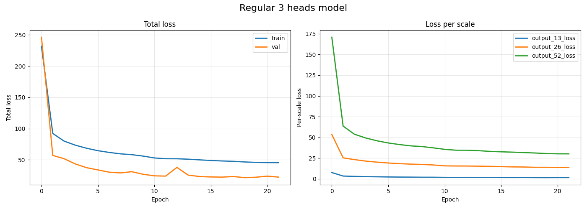
In the case of the first model we can see that val loss went even lower than train loss hitting around 20-25. When it comes to the heads loss - 13x13 head has to lowest loss (around 0) while the highest loss 52x52 head sits at around 27.

### Second model:
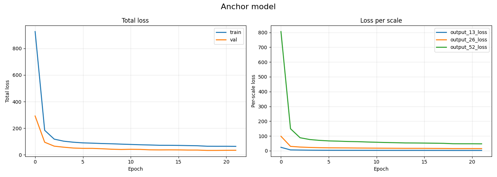

When it comes to the anchor version, we can notice that loss didn't went down as smoothly and deep like in the previous model. Val loss is still lower than the train loss, but it sits around 45-50. We can also observe similar tendency in heads loss, once again 13x13 is the lowest, while 52x52 the highest.

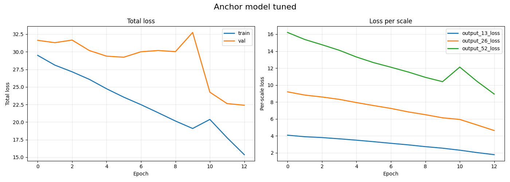

Tuning improved the results, all loss metrics went down significantly. 

### Third model:
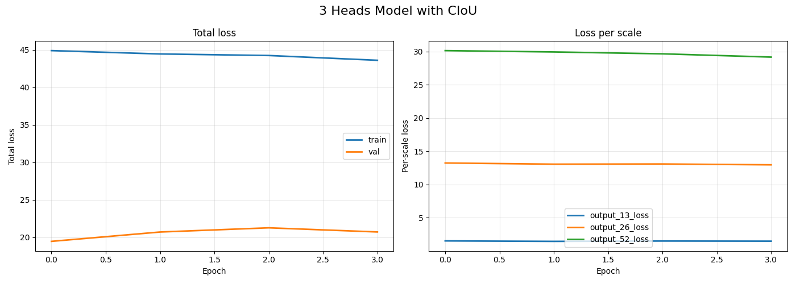

In the final approach I've added CIoU loss and as presented on the graphs it kinda looks similiar to the anchor version but val loss managed to drop to 20ish territory.

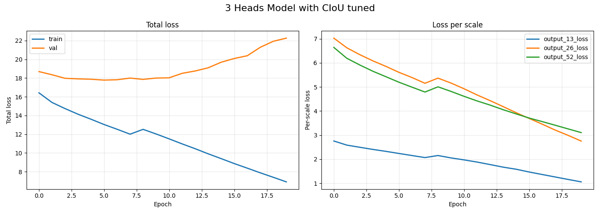

Tuning also managed to drop down loss metrics quite a bit, at least for heads, becasue in val and train loss we can see new pattern, train loss is lower then the val loss, and val loss is increasing, so it was a good time to stop training because model was slowly overfitting.

## Compare

### Regular models

#### Test 1
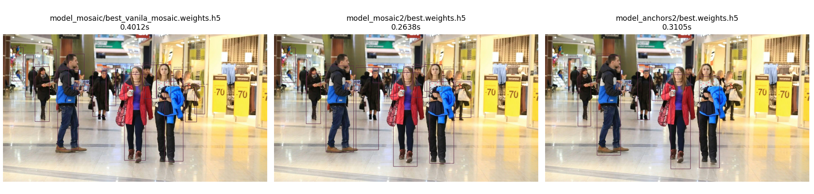

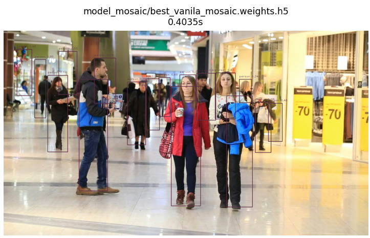
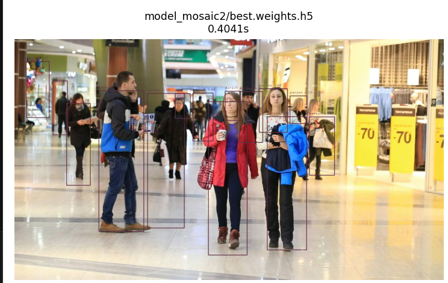
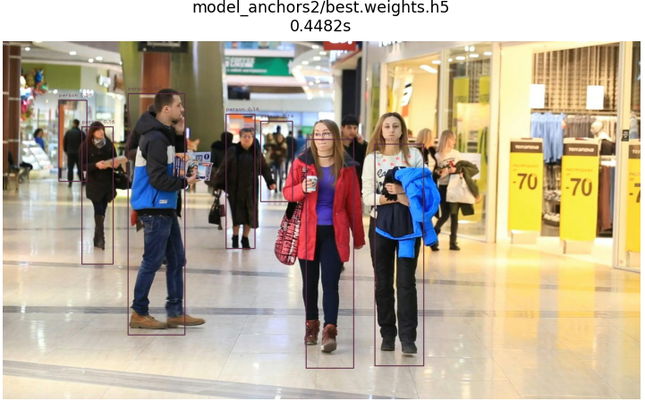

#### Test 2
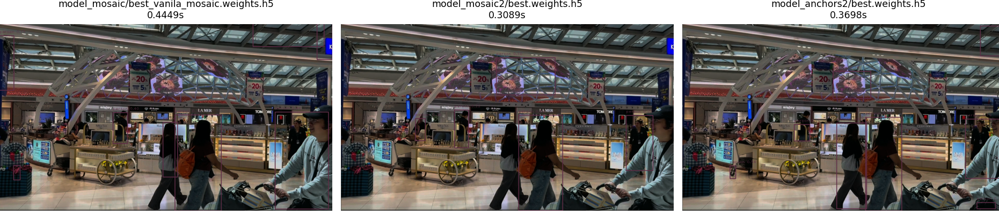
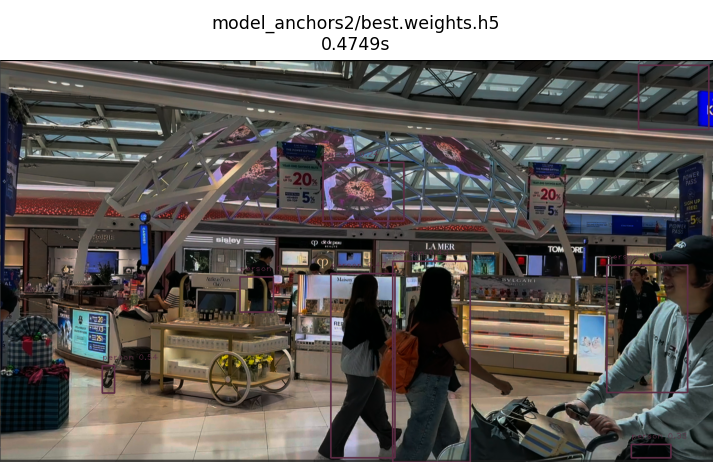
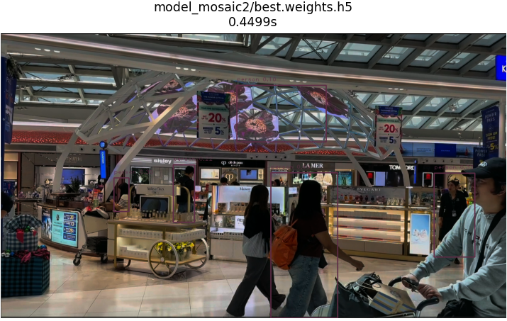
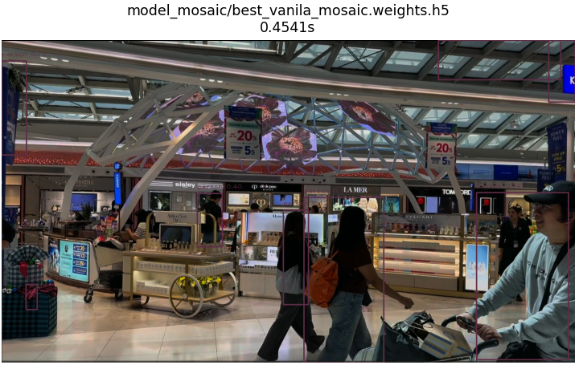

#### Test 3
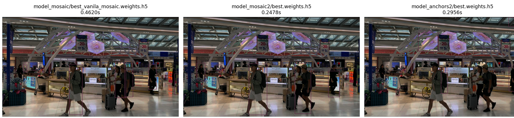
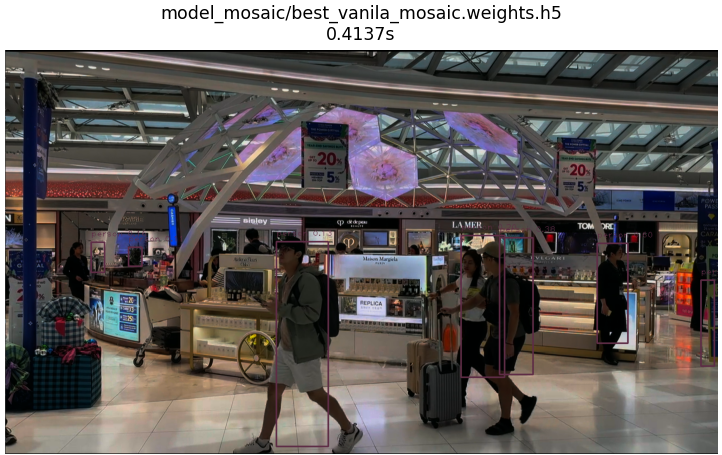
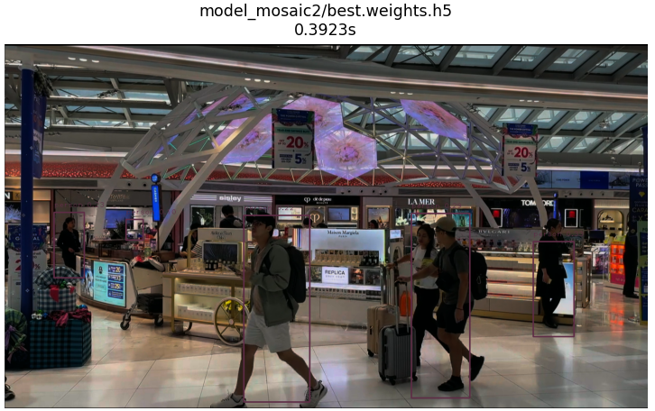
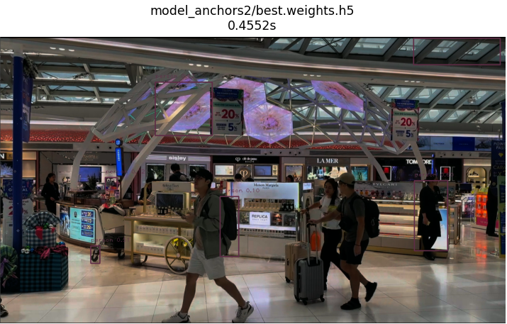

### Tuned models

#### Test 1
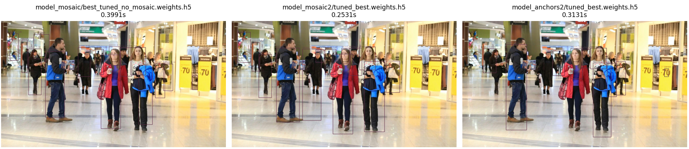
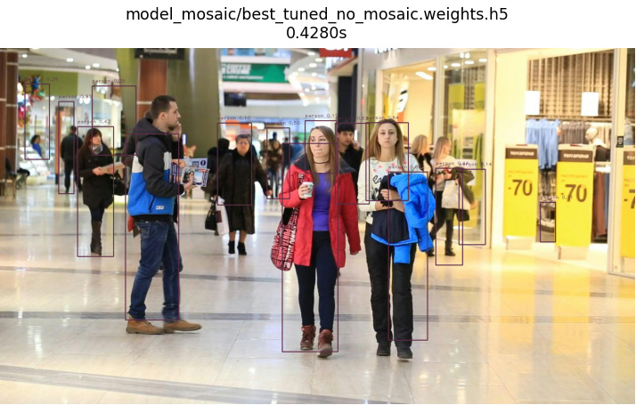
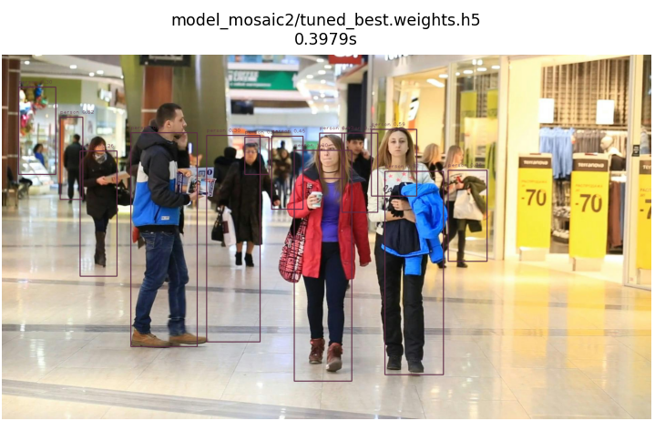


#### Test 2
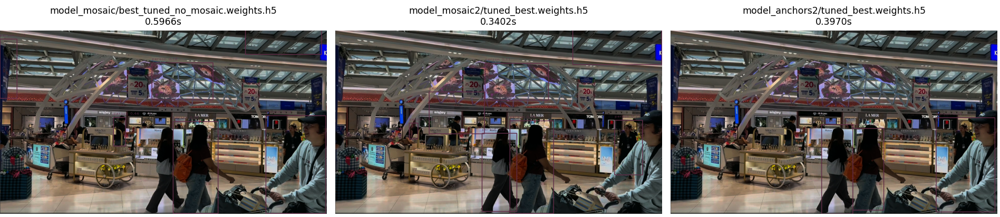
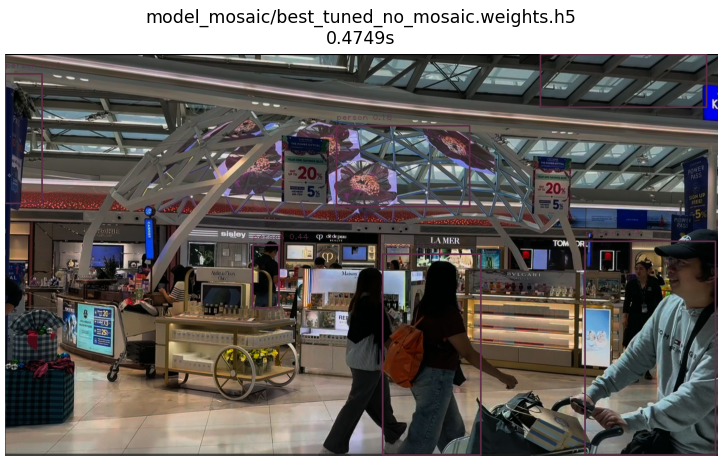
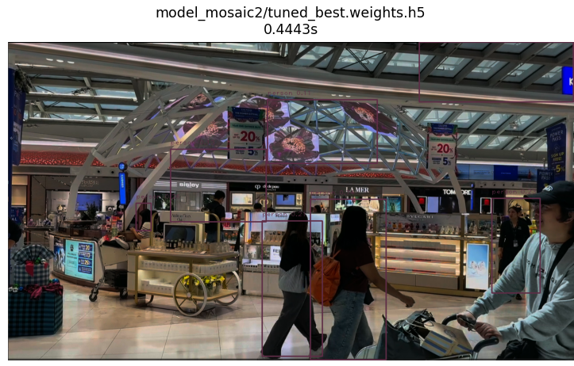
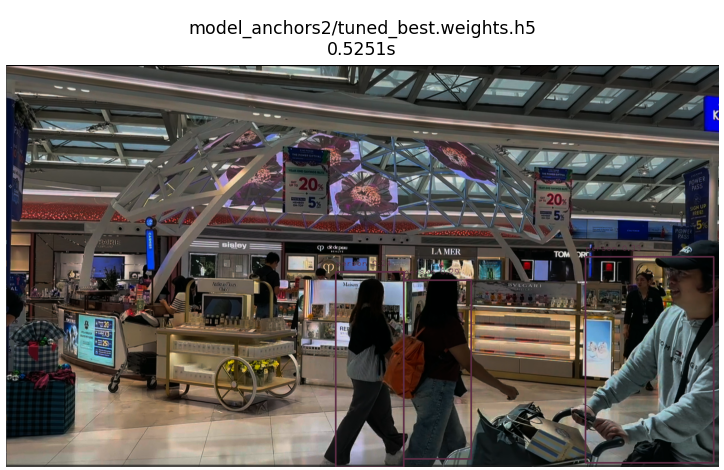

#### Test 3
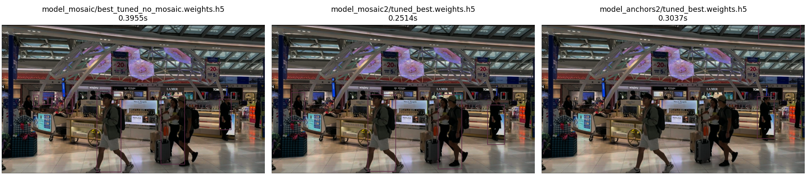
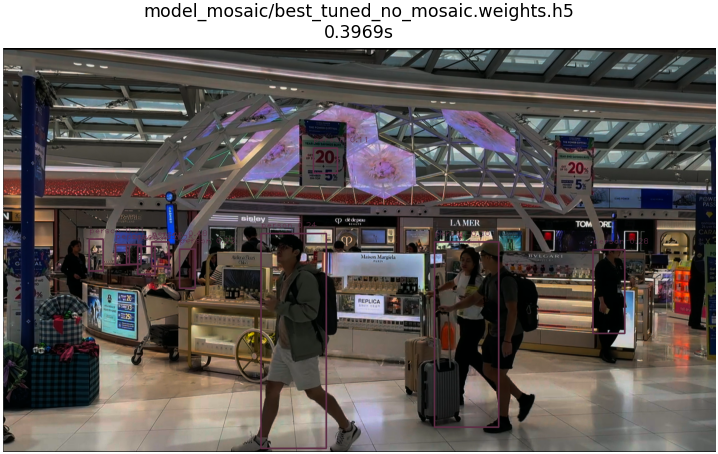
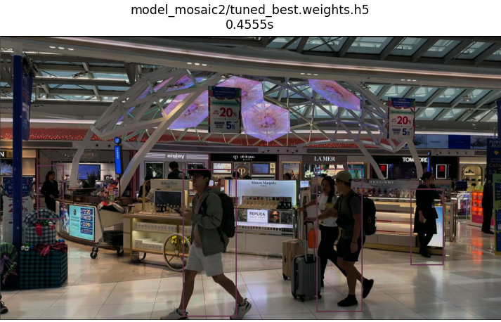
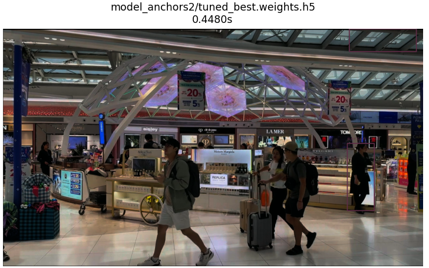

### Colab Notebooks

#### **ObjectDetectionTrain_mosaic.ipynb** - notebook for training regular 3 heads.

#### **ObjectDetectionTrain_mosaic_CIoU.ipynb** - notebook for training regular 3 heads with CIoU.

#### **jajson_anchory_v2.ipynb** - notebook for training anchor version.


### Conclusion
First of all, it is possible to train Yolo-like model using just free Colab environnement with GPU-T4 with decent results. In this case regular 3 heads models seemed to be the most successful, it is visible especially in the Test 2 and 3 in both tuned and regular - in those examples anchor version had more difficulties in detecting smaller objects (people who stand more far away). It's also visible in the training process itself in which anchors models always had higher loss. In the end such project helps to understand how YOLO works. 

## Technical stuff

### Setup
 - Python 3.13+ (3.11+ should be fine as well too)
 - Install requirements:
    ```shell
    pip install -r requirements.txt
    ```

### Libraries
```
matplotlib==3.10.8
numpy==2.4.3
pandas==3.0.2
tensorflow==2.21.0
opencv-python==4.11.0.86
opencv-python-headless==4.11.0.86
```

### Config
As name suggests `config.py` file stores project configuration, the most important are:
```python

# Model params
IMG_SIZE: int  = 416
NUM_BOXES: int = 1
NUM_CLASSES: int = 1
WIDTH_MULT: int = .7
NUM_ANCHORS: int = 3
```

These parameters are specific for each model, but in my case they share the same values, but when u have mix of a different models with different configurations then you might want to remove them from this file.

### Detector
File called `detector.py` is a detector class which provides interface for detecting and displaying results.

#### Parameters:
- model_weights: `Path`
- num_classes: `int` - Depends on the training parameteres.
- num_boxes: `int` - How many boxes one cell of one scale predicts, depends on the training parameteres.
- num_anchors: `int` - Depends on the training parameteres.
- width_mult: `float` - Controls model size, depends on the training parameteres.
- img_size: `int` - Depends on the training parameteres.
- classes_path: `Path`
- use_anchor: `bool` = False - Set to True when using anchor model.

#### Example:
```python
ob = ObjectDetector(
        model_weights=Config.MODELS_FOLDER / "model_mosaic" / "best_tuned_no_mosaic.weights.h5",
        num_classes=Config.NUM_CLASSES,
        num_boxes=Config.NUM_BOXES,
        width_mult=Config.WIDTH_MULT,
        img_size=Config.IMG_SIZE,
        classes_path=Config.CLASSES_FILE,
        use_anchor=False,
        num_anchors=Config.NUM_ANCHORS
    )
img = cv2.imread("pexels-photo-4750056.jpeg")
x = ob.predict_and_show(
    image_input=img,
    iou_threshold=.1
)
```

### Comparing models
Tool for compering models.

#### Example
```python
cm  = CompareModels()

configs = [
    ModelConfig(
        model_weights=Config.MODELS_FOLDER / "model_mosaic" / "best_tuned_no_mosaic.weights.h5",
        num_classes=Config.NUM_CLASSES,
        num_boxes=Config.NUM_BOXES,
        width_mult=Config.WIDTH_MULT,
        img_size=Config.IMG_SIZE,
        classes_path=Config.CLASSES_FILE,
        use_anchor=False,
        num_anchors=Config.NUM_ANCHORS
    ),
    ModelConfig(
        model_weights=Config.MODELS_FOLDER / "model_mosaic2" / "tuned_best.weights.h5",
        num_classes=Config.NUM_CLASSES,
        num_boxes=Config.NUM_BOXES,
        width_mult=Config.WIDTH_MULT,
        img_size=Config.IMG_SIZE,
        classes_path=Config.CLASSES_FILE,
        use_anchor=False,
        num_anchors=Config.NUM_ANCHORS
    ),
    ModelConfig(
        model_weights=Config.MODELS_FOLDER / "model_anchors2" / "tuned_best.weights.h5",
        num_classes=Config.NUM_CLASSES,
        num_boxes=Config.NUM_BOXES,
        width_mult=Config.WIDTH_MULT,
        img_size=Config.IMG_SIZE,
        classes_path=Config.CLASSES_FILE,
        use_anchor=True,
        num_anchors=Config.NUM_ANCHORS
    ),
    
]
cm.load_models(models_config=configs)

img = cv2.imread(r"C:\Users\table\PycharmProjects\MojeCos2\objekt_detekszyn\Screenshot_6.png")
cm.compare_on_image_plt(image=img)
# cm.compare_on_video(
#     video_path=Config.VIDOES_FOLDER / "14735436_1280_720_60fps.mp4",
#     iou_threshold=.2,
#     conf_threshold=.3
# )
```
